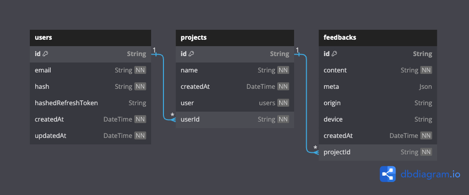
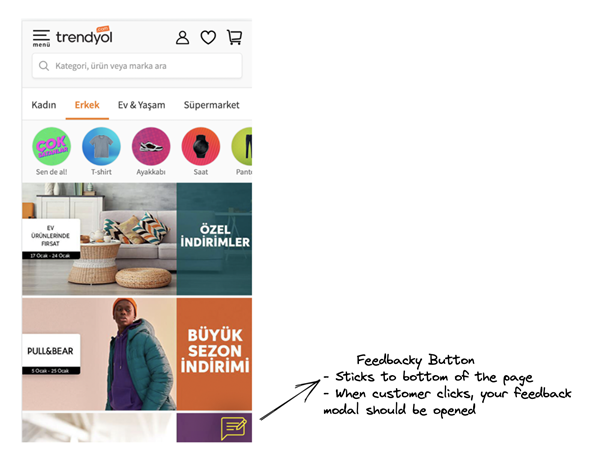
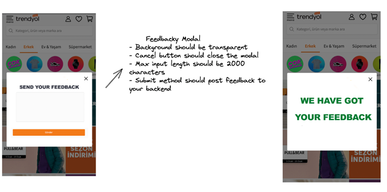

Table of Contents

- [Project Structure](#project-structure) - [Packages](#packages) - [Apps](#apps)
- [Development](#development)
  - [Prerequisites](#prerequisites)
  - [Running the project](#running-the-project)
  - [Running tests](#running-tests)
- [Tech](#tech)
  - [Stack](#stack)
- [Feedbacky](#feedbacky)
  - [Follow Us!](#follow-us)

# Project Structure

This Turborepo includes the following packages and apps:

#### Packages

- [api](./packages/feedbacky): an [Nest.js](https://nestjs.com/) server that provides an API for the client
- [widget](./packages/widget): a [Svelte](https://kit.svelte.dev/) app that provides a widget to be embedded in the client's website.

#### Apps

- [dashboard](./apps/dashboard/): a [Next.js](https://nextjs.org/) app that provides a dashboard for the client to manage their project and feedbacks.

# Development

This project uses [Turborepo](https://turbo.build/) to manage the monorepo.

## Prerequisites

- [Node.js](https://nodejs.org/en/) tested on v18.10.0 (LTS) but should work on any version >= 16.14.0.
- [Docker](https://www.docker.com/) tested on v20.10.24.

> 🚨 If you want to run tests on your local machine, you may need to install following dependencies to run required [bash scripts](./packages/api/scripts/) before tests.
>
> ```
> brew install coreutils && alias timeout=gtimeout
> chmod +x scripts/*
> ```

## Running the project

First we need to set environment variables. You can do this by creating a `.env` file in the root directory of the project. You can use the `.env.test` file as a template.

> 🚨 following `.env` files are required to run the project:

- [api/.env](./packages/api/.env)

To work with [api](./packages/api) and [dashboard](./apps/dashboard) locally, you need setup a local database. You can do this by running following commands:

```bash
docker compose up -d
npm run db:generate
npm run db:push
npm run db:seed
npm run build
npm run dev
```

If you already setup the database, you can run the project with following command:

```bash
npm run dev
```

`npm run dev` command will run all the packages and apps in parallel. If you want to run a specific package or app, you can
use [Turborepo filters](https://turbo.build/repo/docs/core-concepts/monorepos/filtering#multiple-filters) to do so. For example, if you want to run only `api` and `dashboard` packages, you can run following command:

```bash
npm run dev -- --filter=@feedbacky/api --filter=@feedbacky/dashboard
```

By default following ports are used:

- [api](./packages/api): http://localhost:8080
- [dashboard](./apps/dashboard): http://localhost:3000
- [widget](./packages/widget): http://localhost:5173

## Running tests

To run tests, you can use following command:

```bash
npm run test
```

Running this command will automatically create a new database, generate Prisma (and other necessary configurations) for testing, and execute all the tests in parallel.

> 🚨 If you want to run tests on your local machine, you may need to install following dependencies to run required [bash scripts](./packages/api/scripts/) before tests.
>
> ```
> brew install coreutils && alias timeout=gtimeout
> chmod +x scripts/*
> ```

## Online Demo

- api: https://feedbacky-production.up.railway.app
- dashboard: https://feedbacky-dashboard.vercel.app
  - login with following credentials:
    - email: demo@demo.com
    - password: 123456
- widget: https://feedbacky-widget.vercel.app/feedbacky-widget.js
- demo-html: https://feedbacky-demo-html.vercel.app

# Tech Stack

- [Nest.js](https://nestjs.com/)
  - Used to build the API server. Auhtentication is handled by [Passport.js](http://www.passportjs.org/) and [JWT](https://jwt.io/) with refresh tokens. [Jest](https://jestjs.io/) is used for testing.
- [Prisma](https://www.prisma.io/)
  - Used to interact with the database. [PostgreSQL](https://www.postgresql.org/) is used as the database.
    
- [Svelte](https://kit.svelte.dev/)
  - Used to build the widget. 16KB gzipped.
- [Next.js](https://nextjs.org/)
  - Used to build the dashboard. [Tailwind CSS](https://tailwindcss.com/) and [shacdn](https://ui.shadcn.com/) are used for styling. [React Query](https://react-query.tanstack.com/) is used for data fetching.
- [Turborepo](https://turbo.build/) is used to manage the monorepo.

# Feedbacky

Let’s imagine that you’ve decided to build a start-up and that you have a great idea, which is a feedback system that enables customers to give feedback on e-commerce websites. You are both the founder and technical chief of your startup.

So, let’s start building your startup!

**Here are the Acceptance Criteria:**

- You don’t have access to your clients’ code base
- Your client-side code should be easily integrable
- You should show your client’s feedback in a simple HTML table or on a Google Sheet File
- Expected code coverage is 100%
- You can use any tech stack which you feel comfortable with

Your first customer is Trendyol, and you can reach Trendyol’s expectations on the images below:





**Nice to have topics that could help your possible client to buy your service:**

- An online demo
- Well documented product
- Dealing with security concerns
- Bug free and 100% unit test coverage
- Well performanced client side library
- Responsive Design
- Clean code and readable folder structure

**PS:** Please include **"case is done"** in your last commit.

## Follow Us!

[Trendyol Tech Medium](https://medium.com/trendyol-tech)

[Trendyol Open Source GitHub](https://github.com/Trendyol)

[Trendyol Tech Youtube](https://www.youtube.com/channel/UCUBiayLMggBAsiYvGLzQJ5w)

[Trendyol Tech Kommunity](https://kommunity.com/@trendyol)
